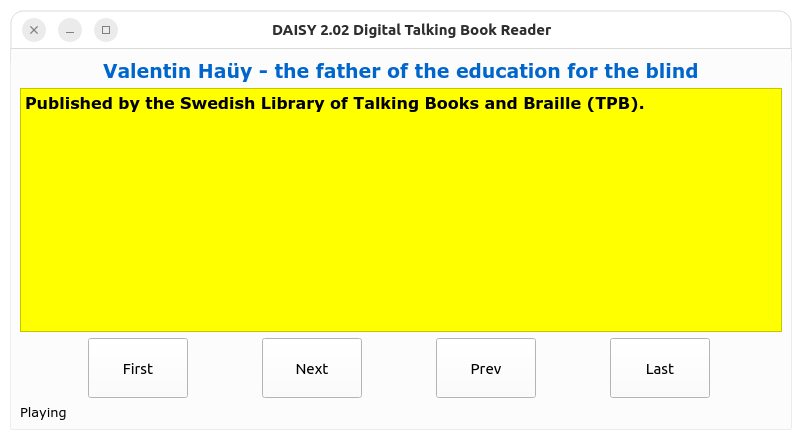

# Usage examples

## Book navigation

### Terminal application

The code is in `examples/navigation/keyboard_navigation.py`.

This is a very basic application that shows what we can do with the `daisy-dtb` package.

In this command-line based application we do this :

   - Setup of a Daisy Book source with `FolderDtbSource`.
   - Create a `DaisyBook` instance from the source.
   - Associate a `BookNavigator` with this Daisy Book.
   - The user can then use the keyboard to navigate in the book.

Keyboard actions :

   - **H** or **?** : Print a help message
   - **F**  : Go to first TOC item
   - **N** : Go to next TOC item
   - **P** : Go to previous TOC item
   - **L** : Go to last TOC item
   - **A** : Play current section audio clips
   - **Q**  : Quit the application

Notes :

   - To play the audio clips, the `pygame` package is used.
   - To get the user key pres actions, we use the `getkey` package.

<figure>

 <figcaption style="font-size: 0.9rem">Screenshot: A simple terminal-based application.</figcaption>
</figure>   

### PySide6 Application

The code is in `examples/navigation/pyside_app.py`.

This is a very basic Qt application using our `daisy-dtb` package that allows to see and watch a Daisy Digital Talking Book. 

In this QApplication based application we do this :

- Setup of a Daisy Book source with `FolderDtbSource`.
- Create a `DaisyBook` instance from the source.
- Pass the `DaisyBook` to a `QMainWindow`.
- Create GUI elements (`QtWidgets`).
- Handle `QPushButton` events to navigate in the book

Notes :

   - To play the audio clips, the `python-vlc` package is used.

<figure>

 <figcaption style="font-size: 0.9rem">Screenshot: A simple Qt application.</figcaption>
</figure>